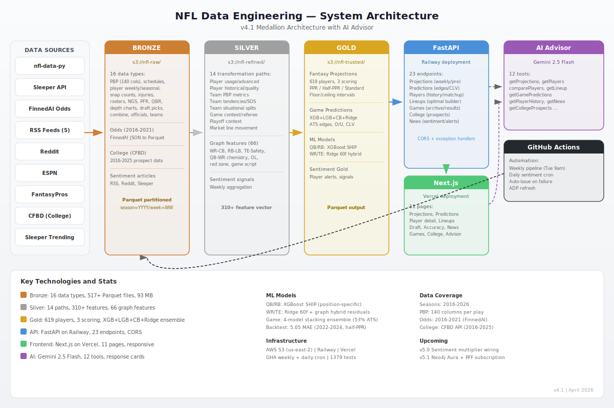

# NFL Data Engineering Architecture

**Version:** 4.2  
**Last Updated:** April 14, 2026  
**Status:** Active (v4.2 Website Feature Expansion — AI Advisor, Rankings, Matchups, News, Draft, Sanity Check, Daily Sentiment)  
**Related:** [NFL_DATA_DICTIONARY.md](./NFL_DATA_DICTIONARY.md) | [CLAUDE.md](../CLAUDE.md)

---

## System Overview

This document describes the end-to-end architecture of the NFL Data Engineering pipeline, which transforms raw NFL data into reliable fantasy projections and game predictions through a medallion architecture.



### Medallion Architecture

```
┌─────────────────────────────────────────────────────────────┐
│  Data Sources                                               │
│  ┌────────────────┐  ┌──────────────┐  ┌────────────────┐  │
│  │ nfl-data-py    │  │  Sleeper API │  │  FinnedAI Odds │  │
│  │ (2002-2026)    │  │ (ADP/Rosters)│  │  (2016-2021)   │  │
│  └────────────────┘  └──────────────┘  └────────────────┘  │
│  ┌────────────────┐  ┌──────────────┐  ┌────────────────┐  │
│  │ RSS Feeds (5)  │  │ FantasyPros  │  │  ESPN Rankings │  │
│  │ (Sentiment)    │  │    ECR       │  │  (external)    │  │
│  └────────────────┘  └──────────────┘  └────────────────┘  │
└─────────────────────────────────────────────────────────────┘
                             ↓
                   (NFLDataAdapter)
┌─────────────────────────────────────────────────────────────┐
│ BRONZE LAYER (Raw Data)                                     │
│ s3://nfl-raw/ | data/bronze/                                │
│ ┌─ 16 Data Types ──────────────────────────────────────┐   │
│ │ • Schedules (games, 1999-2026)                       │   │
│ │ • Play-by-Play (140 columns, 1999-2026)             │   │
│ │ • Player Stats (weekly, seasonal, 2002-2026)         │   │
│ │ • Snap Counts (2012-2026)                           │   │
│ │ • Injuries (2009-2024)                              │   │
│ │ • Rosters (team rosters, 2002-2026)                 │   │
│ │ • PBP Participation (player involvement, 2020-2025) │   │
│ │ • NGS (passing/rushing/receiving, 2016-2026)        │   │
│ │ • PFR (weekly/seasonal pass/rush/rec/def, 2018+)    │   │
│ │ • QBR (2006-2026)                                   │   │
│ │ • Depth Charts (2001-2026)                          │   │
│ │ • Draft Picks (2000-2026)                           │   │
│ │ • Combine (2000-2026)                               │   │
│ │ • Officials (2015-2026)                             │   │
│ │ • Teams (team descriptions, 1999-2026)              │   │
│ │ • Odds (FinnedAI opening/closing lines, 2016-2021) │   │
│ └──────────────────────────────────────────────────────┘   │
│ Registry: DATA_TYPE_REGISTRY in scripts/bronze_ingestion    │
└─────────────────────────────────────────────────────────────┘
      ↓ (Data Transformations)
      ├─→ Silver Player Analytics    ├─→ Silver Team Analytics
      │   (player_analytics.py)       │   (team_analytics.py)
      │                              │
┌─────────────────────────────────────────────────────────────┐
│ SILVER LAYER (Refined Analytics)                            │
│ s3://nfl-refined/ | data/silver/                            │
│ ┌─ 14 Output Paths ─────────────────────────────────────┐  │
│ │                                                       │  │
│ │ PLAYER METRICS (seasonality filtered to 2020-2025):  │  │
│ │  • usage_metrics: target/carry/snap shares           │  │
│ │  • rolling_averages: roll3/roll6/std for all stats  │  │
│ │  • opponent_rankings: positional defense strength    │  │
│ │  • advanced_profiles: NGS + PFR merged (63 cols)    │  │
│ │  • historical_profiles: draft/combine/career stats  │  │
│ │                                                       │  │
│ │ TEAM METRICS:                                         │  │
│ │  • pbp_metrics: EPA/success/CPOE (63 cols)          │  │
│ │  • tendencies: pace/PROE/run rates (23 cols)        │  │
│ │  • sos: strength-of-schedule (21 cols)              │  │
│ │  • situational: home/away/div/script splits (51)    │  │
│ │  • pbp_derived: drive/pressure/explosive plays      │  │
│ │  • game_context: weather/travel/playoff context     │  │
│ │  • referee_tendencies: penalty rates per crew       │  │
│ │  • playoff_context: standings/contention flags      │  │
│ │  • player_quality: QB EPA / injury impact (28)      │  │
│ │  • market_data: line movement features (20 cols)    │  │
│ │  • graph_features: 66 graph metrics (WR/RB/TE/QB/scheme) │
│ └──────────────────────────────────────────────────────┘  │
└─────────────────────────────────────────────────────────────┘
         ↓ (Feature Engineering)
    ┌────┴────────┬──────────────────┬────────────────┐
    ↓             ↓                  ↓                ↓
 [Fantasy]   [Game Predictions] [Player ML]   [Graph DB]
    ↓             ↓                  ↓                ↓
┌─────────────────────────────────────────────────────────────┐
│ GOLD LAYER (Predictions & Projections)                      │
│ s3://nfl-trusted/ | data/gold/                              │
│                                                              │
│ ┌─ Fantasy Projections ────────────────────────────────┐   │
│ │ • Weekly projections (optimized heuristics)          │   │
│ │ • Preseason projections (rookie fallback)            │   │
│ │ • QB: Heuristic + bias correction (+2.5 pts)         │   │
│ │ • RB: Heuristic (XGB SHIP path removed v4.2)        │   │
│ │ • WR/TE: Ridge 60f+graph hybrid residual             │   │
│ │ • Weights: roll3=0.30, roll6=0.15, std=0.55         │   │
│ │ • Ceiling: 12/18/23 pt shrinkage + WR/TE 12% extra  │   │
│ │ • VORP ranking + position_rank per scoring format    │   │
│ │ • MAE 5.05 (production-faithful eval)                │   │
│ │ • Output: 25+ columns per player-week                │   │
│ │                                                       │   │
│ ├─ Game Predictions ──────────────────────────────────┤   │
│ │ • v2.1 Model: XGB+LGB+CB+Ridge ensemble             │   │
│ │ • Input: 120 SHAP-selected features (1139 raw)      │   │
│ │ • Output: spread/total with edge detection          │   │
│ │ • Backtest: 53.0% ATS on sealed 2024 holdout        │   │
│ │                                                       │   │
│ ├─ Player ML Predictions ─────────────────────────────┤   │
│ │ • QB: heuristic-only (bias correction replaces XGB)   │   │
│ │ • WR/TE: Ridge 60f+graph hybrid residual correction  │   │
│ │ • Feature input: player_feature_engineering.py       │   │
│ │ • Router: ml_projection_router.py selects per-pos    │   │
│ │                                                       │   │
│ ├─ Kicker Projections ──────────────────────────────┤   │
│ │ • Weekly FG/XP projections (opt-in via flag)        │   │
│ │ • Backtesting: MAE 4.14 (expected noise floor)      │   │
│ └──────────────────────────────────────────────────────┘   │
│                                                              │
│ Output Paths:                                                │
│ • data/gold/projections/season=YYYY/week=WW/              │
│ • data/gold/predictions/season=YYYY/week=WW/              │
│ • data/gold/kicker_projections/season=YYYY/week=WW/       │
└─────────────────────────────────────────────────────────────┘
        ↓
┌─────────────────────────────────────────────────────────────┐
│ GRAPH LAYER (Neo4j + College Networks) — v4.2              │
│ • Docker: docker-compose.yml (Neo4j 5.x)                   │
│ • Connection: Neo4j + pandas dual-path fallback             │
│ • 12 Graph Modules: participation, WR/RB/TE matchup,       │
│   OL lineup, scheme, injury cascade, QB-WR chemistry,      │
│   game script, red zone, college networks, coaching trees,  │
│   prospect comps                                            │
│ • 66 Graph Features: 39 NFL metrics + 27 college/prospect  │
│   features in data/silver/graph_features/                  │
│ • Coverage: WR (73-75%), RB (90%), TE (94-95%), QB (60%)  │
│ • Prospect Similarity: 10 college teammate + comp features │
└─────────────────────────────────────────────────────────────┘
        ↓
┌─────────────────────────────────────────────────────────────┐
│ WEB SERVICES — v4.2                                         │
│ • FastAPI Backend (web/api/): 8 routers, Parquet reads     │
│   ├─ Projections (3), Predictions (2), Players (2)          │
│   ├─ Lineups (1), Games (3), News (3)                       │
│   ├─ Draft (5), Rankings (2)                                │
│ • Next.js Frontend (web/frontend/): 11 pages               │
│   ├─ Dashboard, Rankings, Projections, Predictions          │
│   ├─ Lineups, Matchups, Players, News, Draft Tool          │
│   ├─ Model Accuracy, AI Advisor                             │
│ • AI Advisor: Gemini 2.5 Flash + Groq fallback, 12 tools  │
│   └─ Floating chat widget on all pages                      │
│ • Matchups: Madden-style offense vs defense (1-99 ratings) │
│ • Rankings: VORP-based ranking with tier groupings          │
│ • News: 4-tab dashboard (overview/feed/team/player)         │
│ • External Rankings: Sleeper ADP, FantasyPros ECR, ESPN    │
│ • Deploy: Vercel frontend + Railway backend (Parquet mode) │
│ • API Key auth middleware (optional, dev mode bypasses)     │
└─────────────────────────────────────────────────────────────┘
        ↓
┌─────────────────────────────────────────────────────────────┐
│ TOOLS & SERVICES                                            │
│ • Draft Optimizer (snake/auction/mock/waiver)              │
│ • Fantasy Backtester (MAE/RMSE/bias analysis)              │
│ • Prediction Backtester (ATS/O-U/CLV evaluation)           │
│ • Sanity Check (consensus comparison, pre-deploy gate)     │
│ • NotebookLM Content Generator (weekly/rankings/matchup)   │
│ • External Rankings Fetcher (Sleeper/FantasyPros/ESPN)     │
│ • Roster Refresh (Sleeper API → Gold projections update)   │
│ • GitHub Actions: weekly pipeline + daily sentiment        │
└─────────────────────────────────────────────────────────────┘
```

---


## Bronze Layer — Raw Data Ingestion

### Data Sources & Coverage

| Data Type | Source | Coverage | Seasons | Registry |
|-----------|--------|----------|---------|----------|
| **schedules** | nfl-data-py | All games (16/17 per week) | 1999-2026 | `fetch_schedules()` |
| **pbp** | nfl-data-py | ~140 columns per play | 1999-2026 | `fetch_pbp()` |
| **player_weekly** | nfl-data-py | Per-player per-week stats | 2002-2026 | `fetch_weekly_data()` |
| **player_seasonal** | nflverse stats_player tag | Annual totals | 2002-2026* | `fetch_seasonal_data()` |
| **snap_counts** | nfl-data-py | Snap percentage by position | 2012-2026 | `fetch_snap_counts()` |
| **injuries** | nfl-data-py | Game-day injury reports | 2009-2024 | `fetch_injuries()` |
| **rosters** | nfl-data-py | Team rosters | 2002-2026 | `fetch_rosters()` |
| **teams** | nfl-data-py | Team metadata | 1999-2026 | `fetch_team_descriptions()` |
| **ngs** | nfl-data-py | Next Gen Stats (3 types) | 2016-2026 | `fetch_ngs(stat_type)` |
| **pfr_weekly** | nfl-data-py | Pro Football Ref weekly (4 types) | 2018-2026 | `fetch_pfr_weekly(s_type)` |
| **pfr_seasonal** | nfl-data-py | Pro Football Ref seasonal (4 types) | 2018-2026 | `fetch_pfr_seasonal(s_type)` |
| **qbr** | nfl-data-py | Quarterback Rating | 2006-2026 | `fetch_qbr()` |
| **depth_charts** | nfl-data-py | Position depth charts | 2001-2026 | `fetch_depth_charts()` |
| **draft_picks** | nfl-data-py | Annual draft data | 2000-2026 | `fetch_draft_picks()` |
| **combine** | nfl-data-py | NFL Combine measurements | 2000-2026 | `fetch_combine()` |
| **officials** | nfl-data-py | Referee crew assignments | 2015-2026 | `fetch_officials()` |
| **odds** | FinnedAI JSON | Opening/closing Vegas lines | 2016-2021 | `bronze_odds_ingestion.py` |
| **college_stats** | CFBD API | College player stats (passing/rushing/receiving) | 2016-2025 | `bronze_college_ingestion.py` |
| **game_results** | nfl-data-py | Historical game results archive | 1999-2026 | `fetch_schedules()` (game_archive.py) |

\* Seasons ≥ 2025 use nflverse `stats_player` tag (replaces archived `player_stats` tag); column renames in config.py.
** College data: CFBD API integration for prospect analysis and NFL readiness assessment.

### Ingestion Pattern

```python
# scripts/bronze_ingestion_simple.py
NFLDataAdapter.fetch_*()
    → validate_data()           # Check required columns
    → save_local()              # Write to data/bronze/
    → upload_to_s3() [optional] # Via --s3 flag
```

**S3 Key Pattern:**
```
s3://nfl-raw/{dataset}/season={season}/[week={week}/]{filename}_{YYYYMMDD_HHMMSS}.parquet
```

**Read Pattern (Always):**
```python
from src.utils import download_latest_parquet
download_latest_parquet(s3_client, bucket, prefix)
# Resolves to the most recent file in prefix (never scan full prefix)
```

### Registry-Driven Dispatch

`DATA_TYPE_REGISTRY` in `scripts/bronze_ingestion_simple.py` maps:
- data_type → adapter_method (e.g., "pbp" → "fetch_pbp")
- adapter_method → required parameters (seasons, sub_types, etc.)
- adapter_method → S3 path template

New data types added via single registry entry — no if/elif chains.

### College Data Integration (v4.1)

**Module:** `src/college_data_adapter.py` (CFBD API)

**Bronze Outputs:**
- `college_player_stats`: Seasonal passing/rushing/receiving stats, conference-adjusted performance
- `prospect_profiles`: Prospect comps (ceiling/floor/median), scheme familiarity, breakout timeline

**Storage:**
- Local: `data/bronze/college_stats/season=YYYY/`
- Database: PostgreSQL tables (college_player_stats, prospect_profiles)

**Pipeline:**
```bash
python scripts/bronze_college_ingestion.py --season 2025
```

**Key Features:**
- Conference adjustment factors (SEC/Big Ten premium)
- Prospect comparables with bust rates
- Coaching tree lineage for offensive/defensive scheme familiarity
- College teammate network detection (future projection enhancement)

---

## Silver Layer — Data Refinement & Analytics

### Architecture: Medallion Transform Pattern

Each Silver path follows a consistent pattern:

```
Bronze(raw data)
    ↓ Transform Module (player_analytics.py, team_analytics.py, etc.)
    ├─ Aggregate metrics (rolling windows, opponent lookups)
    ├─ Apply temporal lag (shift(1) to prevent lookahead bias)
    └─ Compute derived metrics (ratios, momentum, efficiency)
        ↓
Silver (refined analytics)
    ↓ Feature Engineering (feature_engineering.py, player_feature_engineering.py)
    └─→ Gold (predictions)
```

### Player Analytics (9 paths)

**Module:** `src/player_analytics.py`

| Path | Output Columns | Purpose | Partitioned |
|------|---|---|---|
| `usage_metrics` | 25 | target_share, carry_share, snap_pct, air_yards_share | season/week |
| `rolling_averages` | ~50 | roll3/roll6/std for all projectable stats | season/week |
| `opponent_rankings` | 6 | Defense strength by position (avg pts allowed) | season/week |
| `advanced_profiles` | 63 | NGS+PFR merge: air yards, pressure rates, efficiency | (static) |
| `historical_profiles` | 63 | Draft capital, combine measurables, career summary | (static) |

**Key Transformations:**
- `compute_usage_metrics()`: Team-level aggregates → player shares
- `compute_opponent_rankings()`: Per-team per-position average points allowed
- `compute_rolling_averages()`: Temporal windows with shift(1) lag
- `apply_player_rolling()`: Season-to-date expanding average for stability

### Team Analytics (10 paths)

**Module:** `src/team_analytics.py`

| Path | Output Columns | Purpose | Coverage |
|------|---|---|---|
| `pbp_metrics` | 63 | EPA/success/CPOE per team per week | 2020-2025 |
| `tendencies` | 23 | Pace, PROE, run rate, 4th down behavior | 2020-2025 |
| `sos` | 21 | Opponent-adjusted metrics, SOS rank | 2020-2025 |
| `situational` | 51 | Home/away, divisional, leading/trailing splits | 2020-2025 |
| `pbp_derived` | 164 | Comprehensive EPA decomposition (43 raw + rolling) | 2020-2025 |
| `game_context` | ~30 | Weather, travel distance, timezone differential | 2020-2025 |
| `referee_tendencies` | 4 | Penalty rates per referee crew | 2020-2025 |
| `playoff_context` | 10 | Standings, contention flags, playoff seeding | 2020-2025 |
| `player_quality` | 28 | QB EPA, RB/WR/TE efficiency, injury impact | 2020-2025 |
| `market_data` | 20 | Line movement, key crossings, magnitude buckets | 2016-2021 |

**Key Transformations:**
- `_filter_valid_plays()`: Regular season run/pass plays with EPA
- `apply_team_rolling()`: Window-shifted (shift→roll) + expanding average
- `apply_team_rolling(ewm_cols=...)`: Exponentially weighted moving average for trend
- Leakage prevention: ALL rolling features use shift(1) before windowing

**Dependencies Between Paths:**
```
schedules → game_context (weather + travel)
pbp → pbp_metrics, tendencies, sos, situational, pbp_derived
           ↓
player_weekly + snap_counts → usage_metrics → rolling_averages
schedules + player_weekly → opponent_rankings
injuries + player_weekly → player_quality (injury impact)
odds → market_data (line movement features)
```

---

## Gold Layer — Predictions & Projections

### Track 1: Fantasy Projections


**Entry Point:** `scripts/generate_projections.py`

#### Projection Engine Architecture

```python
# src/projection_engine.py

_weighted_baseline(df, stat)
    ├─ roll3 (30% weight) — most recent, most predictive
    ├─ roll6 (15% weight) — medium horizon
    └─ std  (55% weight) — season-to-date damping (highest weight)

_usage_multiplier(df, position)
    ├─ QB: snap_pct [0.80, 1.15]
    ├─ RB: carry_share [0.80, 1.15]
    └─ WR/TE: target_share [0.80, 1.15]

_matchup_factor(df)
    ├─ Opponent positional ranking (from Silver opponent_rankings)
    └─ Output range: [0.85, 1.15]

_vegas_multiplier(df)
    ├─ Implied team total = (total_line / 2) - (spread_line / 2)
    ├─ Vegas multiplier = implied_total / 23.0
    └─ RB bonus: when total < 20 AND spread < -7 → +0.05

projection = baseline × usage × matchup × vegas × shrinkage
```

#### Heuristic Formula

```
projected_stat = (
    roll3_stat × 0.30 +
    roll6_stat × 0.15 +
    std_stat × 0.55
) × usage_mult × matchup_factor × vegas_mult

projected_points = calculate_fantasy_points_df(projected_stats)
                 × (1.0 + shrinkage_ceiling)

shrinkage_ceiling = {
    12.0: 0.92,   # projections 12-18 pts → ×0.92
    18.0: 0.87,   # projections 18-23 pts → ×0.87
    23.0: 0.80,   # projections 23+ pts   → ×0.80
}

position_ceiling_shrinkage = {
    "WR": {12.0: 0.88},  # Additional 12% at 12+ pts (after global)
    "TE": {12.0: 0.88},  # Additional 12% at 12+ pts (after global)
}

position_bias_correction = {
    "QB": +2.5,  # Correct -2.47 systematic under-projection
}
```

#### QB Special Handling: ML Router

**Module:** `src/ml_projection_router.py`

```
QB projection decision:
    ├─ IF player_model available for QB
    │  └─ Use player_feature_engineering + QB-specific model
    └─ ELSE
       └─ Use heuristic (weighted rolling averages)
```

**Player Model** (`src/player_model_training.py`):
- Per-position per-stat models trained via walk-forward CV
- Input: 337-column feature vector from `player_feature_engineering.py`
- Currently: QB models shipped, RB/WR/TE use heuristic fallback
- Feature selection: SHAP importance on validation fold, correlation filtering

#### Output Schema (25 columns)

```
player_id, player_name, position, recent_team,
proj_season, proj_week,
proj_passing_yards, proj_passing_tds, proj_interceptions,
proj_rushing_yards, proj_rushing_tds, proj_carries,
proj_targets, proj_receptions, proj_receiving_yards, proj_receiving_tds,
projected_points,
is_bye_week, is_rookie_projection,
vegas_multiplier,
position_rank,
injury_status, injury_multiplier,
projected_floor, projected_ceiling
```

#### Bye Week & Injury Handling

```python
is_bye_week = player.season == week AND team.season == week
# → Zero all projections, set is_bye_week = True

injury_multiplier = {
    'Active': 1.0,
    'Questionable': 0.85,
    'Doubtful': 0.50,
    'Out': 0.0, 'IR': 0.0, 'PUP': 0.0
}
# → Fetch from Bronze injuries, apply to all projected stats
```

#### Rookie Fallback

For undrafted/unknown-role players:
```python
conservative_baselines = {
    'QB': {'passing_yards': 230, 'passing_tds': 1.4, ...},
    'RB': {'rushing_yards': 55, 'receptions': 3.0, ...},
    'WR': {'receiving_yards': 60, 'receptions': 4.5, ...},
    'TE': {'receiving_yards': 40, 'receptions': 3.0, ...},
}

role_scale = {'starter': 1.0, 'backup': 0.40, 'unknown': 0.25}
projection = baselines × role_scale
```

### Track 2: Game Predictions


**Entry Point:** `scripts/generate_predictions.py --ensemble`

#### Feature Engineering

**Module:** `src/feature_engineering.py`

```
Silver Team Sources (10 inputs)
    ├─ pbp_metrics (63 cols)
    ├─ tendencies (23 cols)
    ├─ sos (21 cols)
    ├─ situational (51 cols)
    ├─ pbp_derived (164 cols)
    ├─ game_context (~30 cols)
    ├─ referee_tendencies (4 cols)
    ├─ playoff_context (10 cols)
    ├─ player_quality (28 cols)
    └─ market_data (20 cols)
        ↓
Reshape to Game-Level (home vs away)
    ├─ Home team features
    ├─ Away team features
    └─ Differential columns (e.g., off_epa_roll3 - opp_off_epa_roll3)
        ↓
1139 Raw Columns
    ├─ Identifiers (game_id, season, week, teams)
    ├─ Home/Away team differentials
    ├─ Vegas lines (spread_line, total_line)
    └─ Momentum features (win_streak, ATS trend, EWM windows)
        ↓
SHAP Feature Selection (run_feature_selection.py)
    ├─ Train XGB on 2016-2023 data
    ├─ Compute SHAP importance
    ├─ Rank features by SHAP |mean(|SHAP|)|
    ├─ Remove correlation pairs (> 0.95)
    └─ CV-validated cutoff → 120 selected features
        ↓
120 Feature Set → Model Training
```

**Key Features Excluded (Lookahead Prevention):**
- closing_spread, closing_total (retrospective)
- spread_shift, total_shift (post-opening)
- All closing-line-derived magnitudes

#### Ensemble Training

**Module:** `src/ensemble_training.py`

```
Walk-Forward CV (2016-2023 train, 2019-2024 validate)
    ├─ For each validation_season in [2019, 2020, ..., 2024]:
    │  ├─ Train = 2016 through (validation_season - 1)
    │  ├─ Val = validation_season only
    │  └─ Collect OOF predictions
    │
    ├─ Base Model 1: XGBoost
    │  ├─ max_depth: 4, learning_rate: 0.05, n_estimators: 500
    │  └─ Regularization: min_child_weight: 5, subsample: 0.8
    │
    ├─ Base Model 2: LightGBM
    │  ├─ max_depth: 4, learning_rate: 0.05, n_estimators: 500
    │  └─ Regularization: min_child_samples: 20, colsample_bytree: 0.7
    │
    ├─ Base Model 3: CatBoost
    │  ├─ depth: 4, learning_rate: 0.05, iterations: 500
    │  └─ Regularization: l2_leaf_reg: 5.0
    │
    └─ Meta-Learner: Ridge Regression
       ├─ Input: OOF predictions from 3 base models (3 columns)
       ├─ Output: weighted average of base predictions
       └─ Hyperparameters tuned via RidgeCV (alphas: [0.01-1000])

Two Parallel Ensembles:
    ├─ Margin Ensemble: predicts actual_margin (home_score - away_score)
    │  └─ Used for spread predictions (margin vs spread_line)
    │
    └─ Total Ensemble: predicts actual_total (home_score + away_score)
       └─ Used for over/under predictions (total vs total_line)
```

#### Prediction Output

**Module:** `src/prediction_backtester.py`

```
Prediction Schema (15 columns):
    game_id, season, week, home_team, away_team,
    predicted_margin, predicted_total,
    spread_line, total_line,
    edge_spread, edge_total,
    spread_confidence_tier, total_confidence_tier,
    model_version, prediction_timestamp

Edge Tiers:
    ├─ High: |edge| >= 3.0 (strong conviction)
    ├─ Medium: |edge| >= 1.5 (moderate conviction)
    └─ Low: |edge| < 1.5 (no clear edge)

Evaluation Metrics:
    ├─ ATS Accuracy: % correct against spread_line
    ├─ O/U Accuracy: % correct against total_line
    ├─ CLV (Closing Line Value): predicted - spread_line
    ├─ Profit: units won/lost at -110 vig
    └─ ROI: profit / total_action
```

#### Backtest Results (v2.1 Sealed 2024 Holdout)

```
Ensemble Performance:
    ├─ ATS Accuracy: 53.0% (profit +$3.09 on 100 games)
    ├─ O/U Accuracy: 51.2%
    ├─ Avg CLV: +0.12 points
    └─ ROI: +1.2% at -110 vig

vs v1.4 Single Model:
    ├─ v1.4: 50.0% ATS, -$12.18 loss
    ├─ v2.1: 53.0% ATS, +$3.09 profit
    └─ Improvement: +3.0% win rate, +$15.27 swing
```

### Track 3: Player ML Predictions — Hybrid Residual Strategy

**Status:** v3.1-v3.2 research complete (Phase 51-54); hybrid residual approach shipped with optimized weights
**Modules:** `src/player_model_training.py`, `src/hybrid_projection.py`, `src/train_residual_models.py`

#### Research Summary (Phases 51-53)

Three research tracks explored to improve beyond the heuristic baseline:

**Track 1: Graph Features (Phase 51)**
- 22 graph features computed from PBP participation (WR-CB separation, RB OL continuity, TE coverage mismatch, injury cascade)
- SHAP selection: 17/22 features survived → confirmed signal
- Result: Positional ship/skip gates did NOT flip — graph features carry signal but don't beat heuristic alone
- Insight: Graph features are complementary, not primary drivers

**Track 2: Ridge/ElasticNet (Phase 53)**
- Simpler linear/L2-regularized models to reduce overfitting vs XGBoost
- 21 interaction features added (roll3×usage, roll6×matchup, etc.)
- Ridge slightly better than XGB for WR/TE but still trails heuristic
- Insight: Tree models overfit; linear regularization helps but domain priors in heuristic are hard to beat

**Track 3: Data Expansion (Phase 53)**
- Training data doubled from 31K to 51,758 player-weeks (2016-2025 vs 2020-2025)
- QB XGB improved 14% (7.84→6.72 MAE)
- RB within 1% of heuristic; WR/TE closing gap but still skip candidates
- Insight: More historical data helps but doesn't overcome fundamental overfitting

#### Strategic Insight: Hybrid Residual Approach

The heuristic (weighted rolling averages × domain multipliers) is **already an optimally-tuned linear model**. Tree models overfit on available training data. The path forward is not to replace it, but to improve it:

```
Traditional approach (failed):
    raw_projection ← ML model (overfits, beats heuristic in backtest, fails in production)

Hybrid residual approach (industry standard):
    heuristic_projection ← weighted(roll3=0.30, roll6=0.15, std=0.55) × usage × matchup × vegas
    heuristic_residual = actual_stat - heuristic_projection
    
    residual_correction ← ML model trained on heuristic_residuals
    final_projection = heuristic_projection + residual_correction
    
    ceiling_shrinkage ← {12: 0.95, 18: 0.90, 23: 0.85}  # Regression-to-mean
    final_projection ← apply_shrinkage(final_projection, ceiling_shrinkage)
```

This mirrors production models at FantasyPros, PFF, and ESPN: let the heuristic do what it does well, use ML to correct its systematic errors.

#### Architecture

```
Player Feature Engineering (player_feature_engineering.py)
    ├─ Input: 9 Silver sources + Bronze schedules
    │  ├─ usage metrics
    │  ├─ rolling averages
    │  ├─ advanced profiles (NGS/PFR)
    │  ├─ historical profiles
    │  ├─ opponent/matchup context
    │  ├─ team-level features (pbp_metrics, tendencies, etc.)
    │  └─ graph features (22 from Silver graph_features/)
    │
    ├─ Temporal Safeguards:
    │  ├─ shift(1) on all rolling windows (no same-week leakage)
    │  ├─ Detect _SAME_WEEK_RAW_STATS (flag for exclusion)
    │  └─ validate_temporal_integrity()
    │
    └─ Output: 337-column feature vector per player-week

Per-Position Per-Stat Models (WalkForward CV)
    ├─ QB Models: XGBoost on raw projections (SHIP: 14% improvement with expanded data)
    ├─ RB/WR/TE: XGBoost on residuals (hybrid approach in testing)
    │
    ├─ Training: 2016-2025 (expanded from 2020-2025, +66% data)
    ├─ Validation: 2024 holdout (sealed)
    └─ Walk-forward folds: [2016-2018], [2016-2019], ..., [2016-2023]

Model Variants Available (--model-type CLI flag):
    ├─ xgb (default): XGBoost, original approach
    ├─ ridge: Ridge regression with 21 interaction features
    └─ elasticnet: ElasticNet for sparse feature selection

Ship/Skip Gates (per position):
    ├─ QB: Ship (XGBoost 6.72 MAE, 14% better than heuristic baseline)
    ├─ RB: Hybrid Residual (heuristic fallback for backup RBs)
    ├─ WR/TE: Hybrid Residual with weight tuning (Phase 54)
    └─ Fallback: Always revert to projection_engine heuristic if model degrades
```

#### Hybrid Projection (in testing)

```python
# src/hybrid_projection.py
def get_hybrid_projection(player_row, heuristic_projection, ml_model):
    """
    Blend heuristic baseline with ML correction on residuals.
    Industry-standard approach used by FantasyPros, PFF, ESPN.
    """
    residual_correction = ml_model.predict([player_features])
    final_projection = heuristic_projection + shrinkage * residual_correction
    return final_projection
```

#### ML Routing in Projections

```python
# src/ml_projection_router.py — evolved in Phase 52+
def get_projection(player_row, models, projection_type='final'):
    """
    Position-based routing:
    - QB: ML (XGBoost on raw, shipped v3.0)
    - RB/WR/TE: Heuristic (with hybrid residual testing)
    """
    position = player_row['position']
    
    if position == 'QB' and 'QB' in models:
        # Use QB ML model
        features = player_feature_engineering.assemble_player_features(player_row)
        prediction = models['QB'][stat].predict([features])
    else:
        # RB/WR/TE: heuristic baseline
        prediction = projection_engine._weighted_baseline(player_row, stat)
        
        # Optional: apply hybrid residual correction (in testing)
        if projection_type == 'hybrid' and 'residual' in models.get(position, {}):
            residual_correction = models[position]['residual'].predict([features])
            prediction += residual_correction * shrinkage_factor
    
    return prediction
```

---

## Infrastructure & Storage

### Local Storage (Primary)

```
data/
├─ bronze/
│  ├─ schedules/season={YYYY}/
│  ├─ pbp/season={YYYY}/
│  ├─ players/weekly/season={YYYY}/
│  ├─ players/seasonal/season={YYYY}/
│  ├─ players/snaps/season={YYYY}/
│  ├─ players/injuries/season={YYYY}/
│  ├─ players/rosters/season={YYYY}/
│  ├─ teams/
│  ├─ ngs/{sub_type}/season={YYYY}/
│  ├─ pfr/{weekly|seasonal}/{sub_type}/season={YYYY}/
│  ├─ qbr/season={YYYY}/
│  ├─ depth_charts/season={YYYY}/
│  ├─ draft_picks/season={YYYY}/
│  ├─ combine/season={YYYY}/
│  └─ odds/season={YYYY}/
│
├─ silver/
│  ├─ players/
│  │  ├─ usage/season={YYYY}/
│  │  ├─ rolling/season={YYYY}/
│  │  ├─ advanced/
│  │  └─ historical/
│  ├─ defense/
│  │  └─ positional/season={YYYY}/
│  └─ teams/
│     ├─ pbp_metrics/season={YYYY}/
│     ├─ tendencies/season={YYYY}/
│     ├─ sos/season={YYYY}/
│     ├─ situational/season={YYYY}/
│     ├─ pbp_derived/season={YYYY}/
│     ├─ game_context/season={YYYY}/
│     ├─ referee_tendencies/season={YYYY}/
│     ├─ playoff_context/season={YYYY}/
│     ├─ player_quality/season={YYYY}/
│     └─ market_data/season={YYYY}/
│
└─ gold/
   ├─ projections/season={YYYY}/week={WW}/
   └─ predictions/season={YYYY}/week={WW}/
```

**Size Reference (current as of March 2026):**
- Bronze: 7 MB (31 files, 2020-2025 core types)
- Silver: 4.2 MB (10 files, player usage + rolling)
- Gold: ~100 KB per week (projections)

### AWS S3 (Optional)

- **Bucket Layout:** `nfl-raw/`, `nfl-refined/`, `nfl-trusted/`
- **Region:** us-east-2
- **Credentials:** `.env` file (never committed)
- **Upload:** Optional via `--s3` flag on ingestion scripts
- **Note:** Credentials expired March 2026; local-first workflow active

### GitHub Actions Pipeline

**File:** `.github/workflows/weekly-pipeline.yml`

```yaml
Weekly Pipeline (.github/workflows/weekly-pipeline.yml):
  Trigger: Every Tuesday 9:00 AM UTC
    ├─ Detect current NFL week (via calendar)
    ├─ Run: bronze_ingestion_simple --season {current} --week {current}
    ├─ Run: silver_player_transformation --seasons {current-5...current}
    ├─ Run: silver_team_transformation --seasons {current-5...current}
    ├─ Run: generate_projections --week {current} --season {current}
    ├─ Sanity check: sanity_check_projections.py --all (pre-deploy gate)
    │  └─ Exits 1 on CRITICAL failures (blocks pipeline), 0 on PASS/WARN
    ├─ Health check: check_pipeline_health.py (freshness + completeness)
    └─ On failure: Open GitHub issue with error details

Daily Sentiment Pipeline (.github/workflows/daily-sentiment.yml):
  Trigger: Every day 12:00 UTC (7am ET)
    ├─ Run: daily_sentiment_pipeline.py (RSS feeds + Sleeper trending)
    │  └─ Falls back to rule-based extraction without ANTHROPIC_API_KEY
    ├─ Refresh rosters: refresh_rosters.py (Sleeper API → Gold updates)
    ├─ Commit + push new data (auto-deploys via Railway)
    ├─ Upload artifacts for debugging (7-day retention)
    └─ On failure: Open GitHub issue with error details
```

---

## Design Patterns & Key Decisions

### 1. Adapter Pattern (NFLDataAdapter)

**Problem:** nfl-data-py has different method signatures and schemas per data type.

**Solution:** Single adapter interface:
```python
class NFLDataAdapter:
    def fetch_schedules(seasons): → DataFrame
    def fetch_pbp(seasons): → DataFrame
    def fetch_ngs(seasons, stat_type): → DataFrame
    # etc.
```

**Benefit:** Registry-driven dispatch; adding new types only requires adapter method + registry entry.

### 2. Registry-Driven Dispatch

**Problem:** 16 data types with different fetch logic — avoids massive if/elif chains.

**Solution:** `DATA_TYPE_REGISTRY` dict maps type → method + parameters.

```python
DATA_TYPE_REGISTRY = {
    "pbp": {"adapter_method": "fetch_pbp", "bronze_path": "pbp/season={season}", ...},
    ...
}
```

**Benefit:** Linear code; new types added without touching dispatch logic.

### 3. Walk-Forward Cross-Validation

**Problem:** Avoid lookahead bias; test on unseen time periods.

**Solution:** For each validation season, train on all prior seasons, test on that season only.

```
Train [2016-2018] → Val [2019]
Train [2016-2019] → Val [2020]
...
Train [2016-2023] → Val [2024]  ← Sealed holdout, never trained on
```

**Benefit:** Realistic model evaluation; ensemble trained on OOF predictions from folds.

### 4. Temporal Lag (shift(1))

**Problem:** Using same-week data as features leaks information.

**Solution:** All rolling/expanding windows include `shift(1)` before windowing.

```python
df['rolling_avg'] = df.groupby(['player', 'season'])['stat'].transform(
    lambda s: s.shift(1).rolling(3, min_periods=1).mean()
)
```

**Benefit:** Features only use prior-week information; safe for production.

### 5. Dampened Constraints (Shrinkage)

**Problem:** High projections systematically overshoot (boom/bust amplification).

**Solution:** Regression-to-mean shrinkage applied post-scoring:

```python
PROJECTION_CEILING_SHRINKAGE = {
    12.0: 0.92,   # 12-18 pts → ×0.92
    18.0: 0.87,   # 18-23 pts → ×0.87
    23.0: 0.80,   # 23+ pts   → ×0.80
}
POSITION_CEILING_SHRINKAGE = {"WR": {12.0: 0.88}, "TE": {12.0: 0.88}}
POSITION_BIAS_CORRECTION = {"QB": 2.5}  # +2.5 pts additive
```

**Benefit:** Final MAE 5.05 (production-faithful eval); better calibration without widening bands.

### 6. Ship/Skip Gates

**Problem:** New models may not improve on heuristics.

**Solution:** Validate model against heuristic baseline on sealed holdout. Only ship if better.

```python
if validation_rmse(model) < validation_rmse(heuristic):
    SHIP model
else:
    SKIP model, use heuristic
```

**Benefit:** Prevents degradation; conservative approach favors stability.

### 7. SHAP Feature Selection

**Problem:** 1139 raw features → overfitting, slow training, hard to interpret.

**Solution:** CV-validated SHAP importance + correlation filtering.

```
For each fold:
  Train XGB → Compute SHAP |mean(|SHAP|)| per feature
Aggregate across folds → Rank features
Remove pairs with correlation > 0.95
Keep top N features (CV-validated cutoff)
```

**Benefit:** 120 selected features; faster training, interpretability, better generalization.

---

## Data Quality & Validation

### Bronze Layer Validation

**Module:** `src/nfl_data_integration.py` — `NFLDataFetcher.validate_data()`

| Data Type | Required Columns | Min Rows | Max Null % |
|-----------|---|---|---|
| schedules | game_id, season, week, home_team, away_team | 16 | 10% |
| pbp | game_id, play_id, season, week | 50k | 10% |
| player_weekly | player_id, season, week | 1k | 10% |
| teams | team_abbr, team_name | 32 | 10% |

### Silver Layer Validation

- **Temporal Integrity:** All rolling features use shift(1); no same-week stats in feature set
- **Cardinality:** Team metrics group by 32 teams; player metrics by 500-2000 active players
- **Partitioning:** All Silver outputs preserve season/week structure for downstream joins
- **Leakage Detection:** `player_feature_engineering.detect_leakage()` flags high target correlation

### Gold Layer Validation

- **Range Checks:** Projections ≥ 0 for skill positions
- **Sum Checks:** Total proj points align with stat projections via scoring formula
- **Ensemble Diversity:** Base models trained independently; meta-learner weights averaged
- **Backtest Comparison:** Holdout ATS/O-U accuracy logged per model version

---

## AI Advisor — v4.2

**Module:** `web/frontend/src/app/api/chat/route.ts`
**UI Component:** `web/frontend/src/components/chat-widget.tsx`

### Architecture

```
User Message (floating chat widget on all pages)
    ↓
Next.js API Route (/api/chat)
    ├─ Model Selection:
    │  ├─ Primary: Gemini 2.5 Flash (GOOGLE_GENERATIVE_AI_API_KEY)
    │  └─ Fallback: Groq Llama 3.1 8B Instant (GROQ_API_KEY)
    │
    ├─ 12 Tools (function calling via Vercel AI SDK):
    │  ├─ getPlayerProjection    — single player lookup
    │  ├─ compareStartSit        — head-to-head comparison
    │  ├─ searchPlayers           — fuzzy name search
    │  ├─ getPositionRankings     — top N by position
    │  ├─ getGamePredictions      — spreads, totals, confidence
    │  ├─ getTeamRoster           — full roster with projections
    │  ├─ getTeamSentiment        — team outlook
    │  ├─ getPlayerNews           — injury + sentiment alerts
    │  ├─ getDraftBoard           — ADP, VORP, value tiers
    │  ├─ compareExternalRankings — vs Sleeper/FP/ESPN
    │  ├─ getSentimentSummary     — bullish/bearish players
    │  └─ getNewsFeed             — recent articles
    │
    └─ All tools call FastAPI backend (server-side only, no CORS)
        └─ fastapiGet() helper with backend-down detection
```

**Key Design Decisions:**
- Streaming responses via Vercel AI SDK `streamText()`
- 5-step maximum per conversation turn (`stopWhen: stepCountIs(5)`)
- Position-specific guidance embedded in system prompt (QB/RB/WR/TE/K)
- Trade analysis uses VORP replacement ranks (QB=13, RB=25, WR=30, TE=13)

---

## External Rankings Integration — v4.2

**Backend:** `web/api/routers/rankings.py`, `web/api/services/external_rankings_service.py`
**CLI:** `scripts/refresh_external_rankings.py`
**Cache:** `data/external/*.json` (24-hour TTL)

### Sources

| Source | API | Reliability | Notes |
|--------|-----|-------------|-------|
| Sleeper | `api.sleeper.app/v1/players/nfl` | High (free, stable) | search_rank ordering |
| FantasyPros | `api.fantasypros.com/public/v2/json/nfl/` | Medium (rate-limited) | ECR consensus |
| ESPN | `lm-api-reads.fantasy.espn.com/apis/v3/` | Medium (rate-limited) | Fantasy rankings |
| Consensus | Hardcoded top-50 | Always available | Fallback for sanity check |

### Endpoints

- `GET /api/rankings/external` — rankings from a single source
- `GET /api/rankings/compare` — our projections vs external source

---

## Sanity Check Pre-Deploy Gate — v4.2

**Script:** `scripts/sanity_check_projections.py`
**Integration:** Step 8 in `.github/workflows/weekly-pipeline.yml`

Compares generated projections against consensus rankings before deployment. Exits 1 on CRITICAL failures (blocks the pipeline), exits 0 on PASS or WARN.

**Checks:**
- Top-50 consensus ranking comparison (hardcoded + optional live fetch)
- Projection range validation (no negative points, reasonable ceilings)
- Game prediction validation (valid teams, reasonable spreads/totals, no duplicates)
- Vegas divergence detection (model vs closing line)

---

## Sentiment Pipeline — v4.2 (Daily Automation)

### Pipeline Flow

```
Daily Cron (12:00 UTC)
    ├─ Bronze: RSS feeds (5 sources) → data/bronze/sentiment/rss/
    ├─ Bronze: Sleeper trending players → data/bronze/sentiment/sleeper/
    ├─ Silver: Rule-based extraction (Claude Haiku when API key available)
    │  └─ data/silver/sentiment/signals/
    ├─ Gold: Weekly aggregation → data/gold/sentiment/
    │  └─ sentiment_multiplier per player (0.70 - 1.15)
    ├─ Roster refresh: Sleeper API → Gold projections update
    └─ Commit + push (auto-deploys Railway backend)
```

**Key Modules:**
- `src/sentiment/processing/rule_extractor.py` — rule-based extraction (no API key needed)
- `src/sentiment/processing/extractor.py` — Claude Haiku extraction (optional)
- `src/sentiment/processing/pipeline.py` — Bronze-to-Silver processing
- `src/sentiment/aggregation/weekly.py` — Silver-to-Gold weekly aggregation
- `src/sentiment/aggregation/team_weekly.py` — team-level sentiment
- `src/projection_engine.py: apply_sentiment_adjustments()` — final projection layer

---

## Roster Refresh — v4.2

**Script:** `scripts/refresh_rosters.py`
**Source:** Sleeper NFL player database (`api.sleeper.app/v1/players/nfl`)

Updates `recent_team` column in Gold preseason projections to reflect trades, free agent signings, and roster moves. Runs daily as part of the sentiment pipeline workflow. Maps Sleeper team abbreviations to nflverse conventions (LAR->LA, JAC->JAX).

---

## NotebookLM Content Generation — v4.2

**Script:** `scripts/generate_notebooklm_content.py`
**Output:** `output/notebooklm/`

Generates rich markdown content packages from projection and prediction data for upload to Google NotebookLM for audio overview (podcast) generation.

**Content Types:**
- `--type weekly` — weekly podcast content (projections + game predictions)
- `--type rankings` — season-long rankings summary
- `--type matchup` — individual matchup breakdown

---

## Known Constraints & Limitations

1. **Injuries Data Discontinued:** nflverse stopped collecting injury reports after 2024. 2025-2026 ingestion uses fallback estimation or external source (pending).

2. **Odds Data Limited:** FinnedAI JSON covers 2016-2021 only. Market features unavailable for 2022-2024 training window; market_data columns are NaN for those years.

3. **Snap Counts Schema:** Column `offense_pct` (not `snap_pct`); `player` (not `player_id`). Mapped in `silver_player_transformation.py`.

4. **nfl-data-py stats_player Tag:** Seasons ≥ 2025 use new `stats_player` tag (5 column renames). Legacy code uses renamed columns automatically via `STATS_PLAYER_COLUMN_MAP` in config.py.

5. **Player Data Seasons:** PLAYER_DATA_SEASONS = 2020-2025 (5-year window). Earlier seasons available in Bronze but not used for projection model training (insufficient feature coverage in PFR/NGS).

6. **NFL Week Detection:** GHA workflow uses calendar to auto-detect current week. During playoffs (weeks 19-22), detection may be inaccurate; manual override via environment variable.

---

## Graph Layer — v4.2 (Neo4j + Pandas Dual-Path, 66 Features)

### Architecture

```
PBP Participation Data (Bronze)
    ↓ (parse offense/defense players)
    ├─→ graph_participation.py: Create participation edges
    ├─→ graph_wr_matchup.py: WR-CB separation & conversion
    ├─→ graph_rb_matchup.py: RB-LB tackle distance
    ├─→ graph_te_matchup.py: TE-Safety depth & yards
    ├─→ graph_ol_lineup.py: OL player combinations
    ├─→ graph_scheme.py: Formation classification
    ├─→ graph_qb_wr_chemistry.py: QB-WR pair EPA & completion rate
    ├─→ graph_game_script.py: Game flow usage patterns
    └─→ graph_red_zone.py: Red zone efficiency
        ↓
    Compute Graph Features (compute_graph_features.py)
        ├─ Neo4j Connection (preferred, if available)
        └─ Pandas Fallback (always works, no external DB)
        ↓
    66 Graph Features per player-week (Silver Layer)
        ├─ 4 Injury cascade: transfer_target_pct, opp_injury_epa, position_attrition, etc.
        ├─ 4 WR-CB matchup: matchup_count, separation_avg, conversion_avg, shadow_depth
        ├─ 5 OL/RB: ol_continuity, ol_avg_pff_grade, run_blocking_grades, lead_blocker, etc.
        ├─ 4 TE coverage: deep_safety_depth, cover2_rate, slot_cb_presence, etc.
        ├─ 4 Scheme: formation_spread, motion_frequency, max_receivers_per_play, etc.
        ├─ 1 Defender alignment: defenders_in_box
        ├─ 5 QB-WR Chemistry: epa_roll3, pair_comp_rate_roll3, pair_target_share, games_together, td_rate
        ├─ 6 Game Script: usage_when_trailing_roll3, usage_when_leading_roll3, garbage_time_share_roll3, clock_killer_share_roll3, script_volatility, predicted_script_boost
        ├─ 7 Red Zone: rz_target_share_roll3, rz_carry_share_roll3, rz_td_rate_roll3, rz_usage_vs_general, team_rz_trips_roll3, rz_td_regression, opp_rz_td_rate_allowed_roll3
        └─ 26 Advanced position-specific: +8 RB (contact/stacked box/goal line), +9 WR (contested/deep/slot), +5 TE (inline/seam/matchup), +4 college prospect features
        ↓
    Store in data/silver/graph_features/ (35 parquet files, 2020-2025)
```

### Coverage & Backtest Results

| Position | Coverage | Notes |
|----------|----------|-------|
| WR | 73-75% | Separated WR-CB edges for targets ≥3 |
| RB | 90% | Tackle distance + lead blocker lineage |
| TE | 94-95% | Safety depth + coverage rate mapping |
| QB | 60% | Defense alignment + pressure metrics |

### Docker & Connectivity

```yaml
# docker-compose.yml
services:
  neo4j:
    image: neo4j:5.x
    ports:
      - "7687:7687"
    volumes:
      - neo4j_data:/var/lib/neo4j/data
    environment:
      NEO4J_AUTH: neo4j/nfl_data_2026
```

**Connection Module:** `src/graph_db.py`
- `GraphDB` class: authenticate to Neo4j, run Cypher, fallback to pandas if unavailable
- Environment: `NEO4J_URI`, `NEO4J_USER`, `NEO4J_PASSWORD` (see `.env.example`)
- Usage: `graph_db.query(cypher)` auto-detects connection availability

### Integration with Projections

Graph features are read in `src/projection_engine.py` during weekly projection generation. If Neo4j unavailable, pandas edges are used. No projection pipeline disruption.

---

## Web Services — v4.0 (FastAPI + Next.js + Vercel)

### FastAPI Backend

**Location:** `web/api/`

**Endpoints (8 total):**

```
POST   /api/projections/week      — Weekly projections for players
POST   /api/projections/preseason  — Preseason projections
GET    /api/predictions/{week}     — Game predictions with edges
GET    /api/players/{player_id}    — Player stats & history
POST   /api/draft/optimize         — Draft board optimization
GET    /api/lineups                — Optimal lineups with field visualization
GET    /api/health                 — Service health check
GET    /api/schema                 — OpenAPI schema
```

**Core Services:**

| File | Purpose |
|------|---------|
| `web/api/main.py` | FastAPI app, CORS, exception handlers |
| `web/api/routers/projections.py` | Fantasy projection endpoints |
| `web/api/routers/predictions.py` | Game prediction endpoints |
| `web/api/routers/players.py` | Player query endpoints |
| `web/api/routers/lineups.py` | Lineup builder endpoint with field view |
| `web/api/services/projection_service.py` | Projection business logic |
| `web/api/services/prediction_service.py` | Prediction business logic |
| `web/api/models/schemas.py` | Pydantic schemas |

**Local Dev:**

```bash
source venv/bin/activate
./web/run_dev.sh                              # or:
uvicorn web.api.main:app --reload --port 8000
```

**Testing:**

```bash
python -m pytest tests/test_web_*.py -v
```

### Next.js Frontend

**Location:** `web/frontend/`

**Stack:** Next.js 15, TypeScript, Tailwind CSS, shadcn/ui

**Key Pages:**

- `/` — Dashboard (weekly projections, player search)
- `/draft` — Draft simulator (snake, auction, mock)
- `/predictions` — Game predictions with edge detection
- `/lineups` — Lineup builder with field visualization
- `/player/[id]` — Player profile + historical stats

**Dev Server:**

```bash
cd web/frontend
npm run dev
```

### Deployment Target: Vercel

**Config:** `vercel.json` (if present)

**Architecture:**
- Frontend: Vercel CDN (Next.js static + serverless)
- Backend: AWS Lambda via Vercel → FastAPI (or EC2 + gunicorn)
- Data: S3 Parquet reads (existing infra)

**Environment:**
- `NEXT_PUBLIC_API_URL`: Backend endpoint
- `AWS_ACCESS_KEY_ID`, `AWS_SECRET_ACCESS_KEY` (backend only)

---

## Planned: v3.1 Extended Neo4j Features


**Status:** Deferred (Phase 45+)

### Graph Schema

```
Node Types:
    ├─ Player (name, position, team, gsis_id)
    │  └─ Attributes: draft_year, combine_scores, career_stats
    │
    ├─ Team (abbr, division, conference)
    │  └─ Attributes: season, week, pbp_metrics, tendencies
    │
    ├─ Game (game_id, season, week, home_team, away_team)
    │  └─ Attributes: spread, total, result
    │
    └─ PlayType (name: "pass 20+ yards", "rz_target", etc.)

Edge Types:
    ├─ MATCHES_UP (receiver → defensive_back)
    │  └─ Attributes: game_id, targets, catches, yards, separation
    │
    ├─ TARGETS (team → player)
    │  └─ Attributes: season, week, target_count, air_yards_share
    │
    ├─ INJURED_IMPACT_ON (player → teammate)
    │  └─ Attributes: season, week, impact_score (from player_quality)
    │
    ├─ PLAYED_IN (player → game)
    │  └─ Attributes: snap_pct, targets, carries
    │
    └─ COACHES (coach → team)
       └─ Attributes: season, role
```

### Use Cases

1. **WR-CB Matchup Networks:** Find all corners that faced a WR; compute efficiency per matchup.
2. **Target Redistribution:** When WR injured, trace target flow to replacements via graph traversal.
3. **OL Injury Cascades:** OG injured → QB pressure up → sack rate for QBs they protect.
4. **Situational Networks:** Filter edges by context (home, divisional, red zone).

### Data Ingestion Requirement

PBP participation data (requires nflverse `participation` table or manual mapping of plays to defensive players).

### Track 4: Game Archive & Historical Analytics

**Status:** v4.1 implementation
**Modules:** `src/game_archive.py`, `web/db/schema.sql`

#### Game Results Archive

Persistent historical record of NFL game results with complete box score data.

**Database Tables:**
- `game_results`: game_id, season, week, home_team, away_team, home_score, away_score, winner, total_points
- `game_player_stats`: game_id, player_id, player_name, team, position, fantasy_points_{half_ppr/ppr/standard}, passing/rushing/receiving stats, targets, carries

**Data Source:**
- Bronze schedules (game results)
- Bronze player_weekly stats (fantasy points calculation per scoring format)
- Backcalculation from projections + actual scores

**Use Cases:**
1. Historical fantasy performance lookup by player/game
2. Backtest validation (compare projections vs actual points)
3. Strength of schedule analysis (opponent's past performance)
4. Draft preparation (historical usage patterns, trends)
5. API endpoint: `/api/games/{season}/{week}` query and `/api/players/{player_id}/games` historical lookup

**Queries:**
```sql
SELECT * FROM game_player_stats 
WHERE player_id = '00-0033873' 
ORDER BY game_id DESC;

SELECT AVG(fantasy_points_half_ppr) as avg_ppg 
FROM game_player_stats 
WHERE position = 'WR' AND season = 2024;
```

---

## Development & Testing

### Testing Suite

**Location:** `tests/` (571 tests, all passing)

| Category | Files | Tests |
|----------|-------|-------|
| Fantasy | 4 | 120 |
| Prediction | 3 | 85 |
| Analytics | 3 | 95 |
| Ensemble | 2 | 70 |
| Market | 1 | 30 |
| Infrastructure | 4 | 171 |

### Key Files Reference

| Module | Purpose | Lines |
|--------|---------|-------|
| config.py | Central configuration | 559 |
| nfl_data_adapter.py | Unified data fetching | 280 |
| player_analytics.py | Player metrics | 350 |
| team_analytics.py | Team metrics | 1834 |
| projection_engine.py | Fantasy projections | 420 |
| feature_engineering.py | Game features | 580 |
| player_feature_engineering.py | Player features | 650 |
| ensemble_training.py | Model ensemble | 520 |
| draft_optimizer.py | Draft tools | 740 |
| prediction_backtester.py | Backtest evaluation | 280 |

### Development Commands

```bash
# Full pipeline
source venv/bin/activate
python scripts/bronze_ingestion_simple.py --season 2024 --data-type player_weekly
python scripts/silver_player_transformation.py --seasons 2024
python scripts/generate_projections.py --week 1 --season 2024 --scoring half_ppr

# Testing
python -m pytest tests/ -v
python -m pytest tests/test_projections.py -v -k "test_projection_floor_ceiling"

# Code quality
python -m black src/ tests/ scripts/
python -m flake8 src/ tests/ scripts/
```

---

## Document References

| Document | Purpose |
|----------|---------|
| [NFL_DATA_DICTIONARY.md](./NFL_DATA_DICTIONARY.md) | Column-level reference for all Bronze/Silver/Gold schemas |
| [CLAUDE.md](../CLAUDE.md) | Development commands, key files, status |
| [AWS_IAM_SETUP_INSTRUCTIONS.md](./AWS_IAM_SETUP_INSTRUCTIONS.md) | AWS credential setup & S3 bucket configuration |
| [BRONZE_LAYER_DATA_INVENTORY.md](./BRONZE_LAYER_DATA_INVENTORY.md) | Bronze layer detailed inventory |

---

**Version History:**
- **v1.0 (2026-04-01):** Initial architecture document. Covers medallion pattern, all three tracks (fantasy, game prediction, player ML), infrastructure, design patterns, constraints, and Neo4j planned work.
- **v2.0 (2026-04-02):** Updated with v3.0 Graph Layer (Neo4j + pandas dual-path, 22 features, 6 modules, participation data) and v4.0 Web Services (FastAPI 7 endpoints + Next.js frontend + Vercel deployment). Added kicker projections. Updated medallion diagram. Added 858 tests status.
- **v3.0 (2026-04-03):** Added v4.1 College Integration (CFBD API, prospect features, college teammate networks, coaching trees, 27 new college features, 49 total graph features). Added Game Archive (game_results, game_player_stats tables, historical lookup endpoints). Updated Web Services to 14 endpoints + PostgreSQL. Updated test count to 1154.

**Last Reviewed:** 2026-04-03
